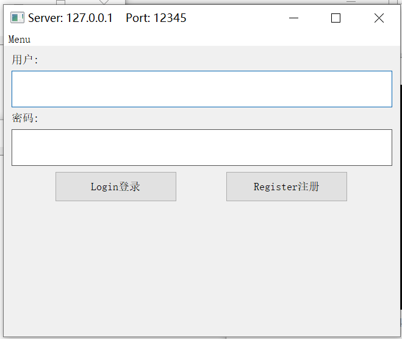
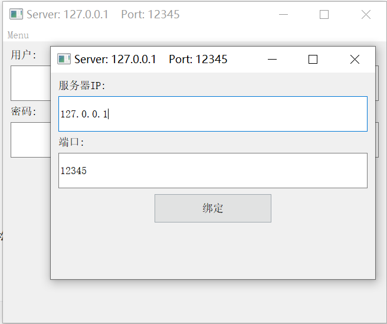
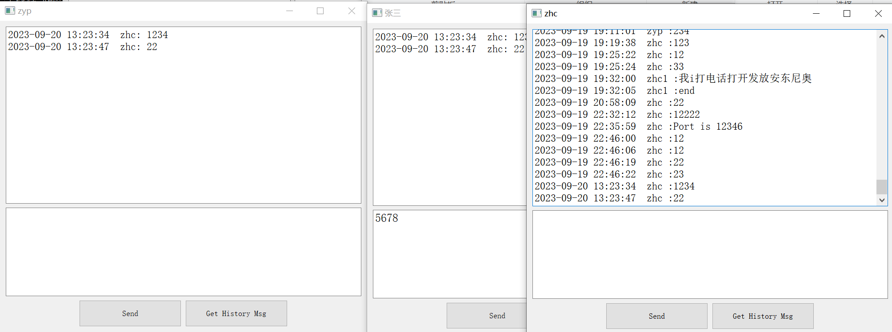
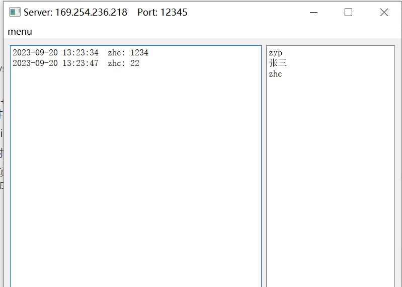
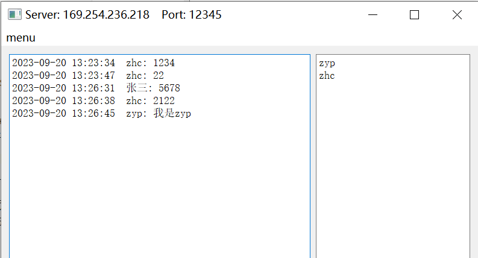

## 多人在线聊天软件

https://github.com/zhonghub/projs/tree/main/Cpp/OnlineChat

### 一 展示

#### 1 客户端

##### 登录页面

|  |  |
| ------------------------------------------------------------ | ------------------------------------------------------------ |

##### 消息发布页面

每个客户端发送的新消息，会被服务器广播给其他在线用户



#### 2 服务器

**UI层**：显示累计发布的新消息，以及当前的在线用户

**业务逻辑层：**处理每个客户端发送的各种请求（注册，登录，发布消息，获取全部消息，建立专门接收新消息的TCP连接）并作出相应回复，同时广播新消息给每个在线用户。

|  |  |
| ------------------------------------------------------------ | ------------------------------------------------------------ |

####  3 说明

1. 所有用户都在同一个群聊里

2. 使用套接字（WinSock2.h）通信，连接方式均为TCP连接

3. 数据库使用MySQL数据库，只有两张表，Users表和Msg表

4. 仿照以前做的IOS应用，客户端和服务器均采用MVC架构：

   1. M是业务处理逻辑，如网络通信，数据库增删改查
   2. V是纯UI界面，采用QT实现。
   3. C是控制器，客户端和服务器均有一个Controller，负责M和V的间接交互。M和V直接是隔离的（解耦合），相互影响均通过Controller来实现，以客户端为例，客户端V的某些button绑定事件，又或者业务逻辑（接收到新消息）导致UI需要更新。


#### 4 消息格式

##### json库配置：

使用jsoncpp实现：将客户端发送消息的键值对转换为**json字符串**，以及从**json字符串**解析为消息的键值对。

c++json库项目地址： [GitHub - open-source-parsers/jsoncpp: A C++ library for interacting with JSON.](https://github.com/open-source-parsers/jsoncpp)

c++json库（jsoncpp）简单使用方法：https://blog.csdn.net/luxpity/article/details/116809954

操纵

1. 打开下载的**jsoncpp**文件夹
2. 运行**amalgamate.py**文件（需要有python环境）
3. 生成了一个dist的文件夹，里面的两个.h文件和一个.cpp文件分别加入项目的头文件和源文件中，一起编译即可。

##### 消息说明

客户端发送的json字符串的key值最多有5个：key = ["code",username","password","time","msg"];

根据接收消息的code值对数据库进行相应操作，并返回操作结果
code, 请求编号： 
    0：专门接收新消息的套接字
    1：登录
    2：注册
    3：发布消息
    4：请求全部历史消息
username, 用户名 
password，密码
time，时间
msg, 消息


### 二 项目构建和运行

打开每个项目下的a.bat，在cmd运行qmake -tp vc，使用qmake构建项目，然后双击生成的.vcxproj文件打开vs项目。

#### qmake示例：

```makefile
# qmake -tp vc
QT += core gui

QT += widgets

CONFIG += console qt c++11

DEFINES += QT_DEPRECATED_WARNINGS

TARGET = client

TEMPLATE = app

SOURCES += z_src/ChatWindow.cpp \
    z_src/MainWindow.cpp \
    z_src/Client.cpp \
    z_src/ClientController.cpp \
    z_src/myUseFun.cpp \
    z_src/main.cpp \
    include\jsoncpp.cpp

HEADERS += z_include/MainWindow.h \
    z_include/ChatWindow.h \
    z_include/Client.h \
    z_include/ClientController.h \
    z_include/myUseFun.h \
    include\json\json.h \
    include\json\json-forwards.h \
```


### 三  解决vs2019的mysql的odbc依赖问题

在服务器程序所在的VS项目中，由于需要操纵MySQL数据库，需要设置项目属性。

#### 1. 项目/属性/vc++目录/包含目录（放的.h头文件）

C:\Program Files\MySQL\Connector C++ 8.0\include\jdbc

#### 2. 库目录（放的.lib文件）

C:\Program Files\MySQL\Connector C++ 8.0\lib64\vs14

#### 3. 链接器/输入/附加依赖项

C:\Program Files\MySQL\Connector C++ 8.0\lib64\vs14\mysqlcppconn.lib

#### 4. 将 DLL 复制到项目输出目录：项目属性/生成事件/生成后事件

如果你有多个 DLL 文件，你可以设置一个自定义的“生成事件”，在编译时将这些 DLL 文件复制到项目

输出目录（Debug 或 Release 文件夹）。复制 DLL 文件到输出目录。

copy /Y "Path1\mysqlcppconn-9-vs14.dll" "$(TargetDir)"

copy /Y "Path2\other.dll" "$(TargetDir)"

生成后事件： 

copy /Y "C:\Program Files\MySQL\Connector C++ 8.0\lib64\mysqlcppconn-9-vs14.dll" "$(TargetDir)"


### 四 数据库相关

```sql
DROP TABLE Users;
DROP TABLE Msg;

// 创建两张表，用户表和消息表，设置实体完整性和参照完整性
create table Users(
User_id INT(4) AUTO_INCREMENT,
User_Cde varchar(20), 
User_Pass varchar(20) NOT NULL, 
User_LogTime varchar(20) NOT NULL,
PRIMARY KEY (User_Cde),
UNIQUE KEY (User_id)
)ENGINE=InnoDB;

create table Msg(
Msg_id INT(4) AUTO_INCREMENT,
User_Cde varchar(20) NOT NULL , 
Msg varchar(30) NOT NULL, 
WriteTime varchar(20) NOT NULL,
PRIMARY KEY (Msg_id),
FOREIGN KEY(User_Cde) REFERENCES Users(User_Cde)
)ENGINE=InnoDB;

创建索引
CREATE UNIQUE INDEX msg_id_index ON Msg(Msg_id);

插入
INSERT INTO users VALUES(0 , 'zhc' , '123' ,  '2023-09-15 10:54:23')
insert into Msg(User_Cde,Msg,WriteTime) values('zhc' , '12223' ,  '2023-09-15 10:54:23');

搜索
select User_Cde from Users where User_Cde=s1
select User_Pass from Users where User_Cde=s1
select User_Cde,Msg,WriteTime From Msg order by Msg_id;
```

