## 【实验项目】**多人在线聊天程序**

程序分为服务器和客户端。

### 【功能描述】

​     

 

本程序为一个多人聊天程序，每个用户都可以发送消息，所有用户都可以收到，见上图，功能类似QQ。

用户在登录后才能发送消息，登录时服务器要*检测用户是否存在，密码是否正确，是否重复登录*。

登录后客户端立即从服务器取到所有历史消息（所有消息都保存在MySQL数据库里）。

用户可以取消登录或退出。

可以注册新用户。

在服务器绑定端口后客户端才能登录。服务器可以解除绑定。服务器显示当前登录用户和他们发布的消息。

服务器使用mysql数据库。

### 运行结果截屏

服务器和客户端在不同主机上也可正常运行，只需更改客户端的参数host（为服务器的ip），可以在源码中修改，也可以在客户端的文件/设置中修改，如下图：

​                                                       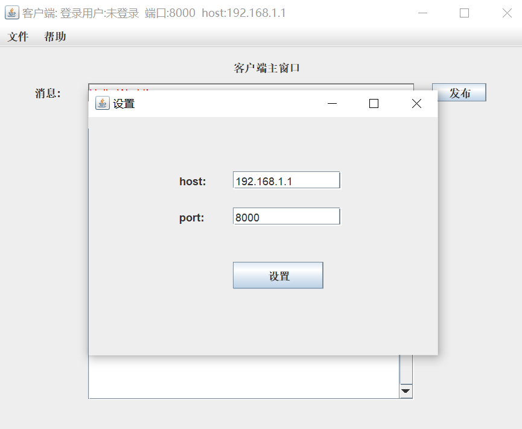 

**服务器窗口：**

**服务器端口绑定：**

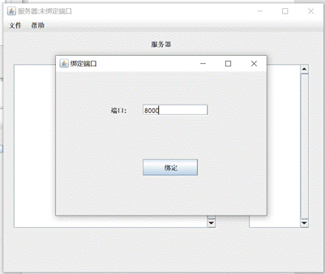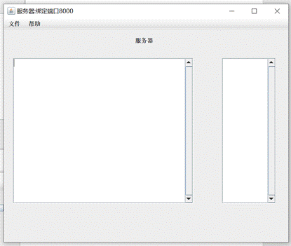

**客户端：**

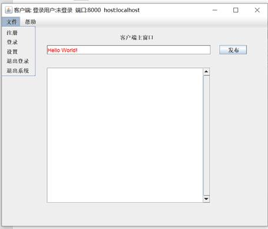

**注册：**

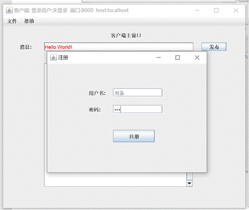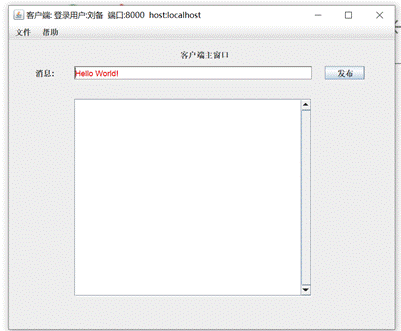

**登录：**

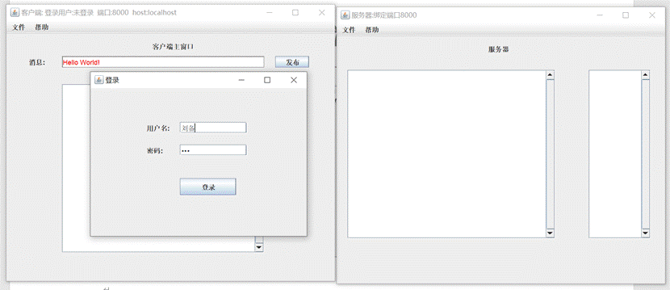

**登录结果：可见服务器的登录用户列表增加了该用户**

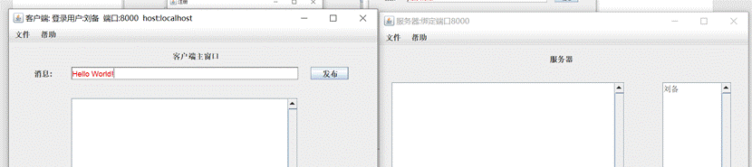

**发布消息：**

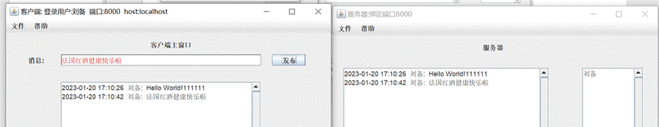

**退出登录：**

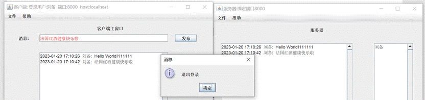

**退出登录之后的客户端和服务器：服务器在线用户列表减少了该用户**

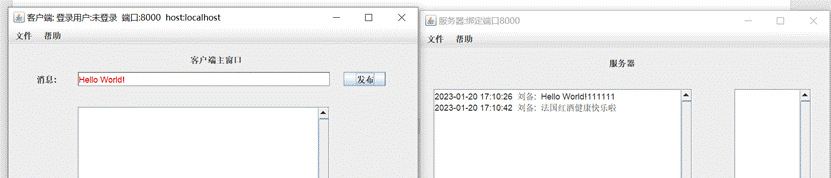

**登录另一个用户：**

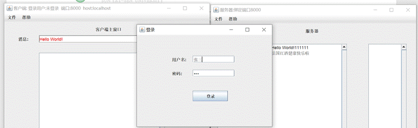

**该用户发布消息：**

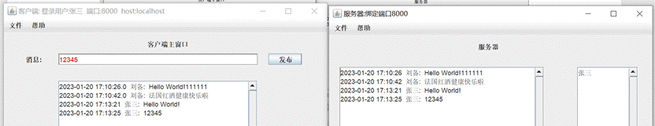

**退出再重新进入程序：**

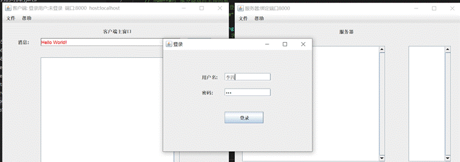

**发布几条消息：**

可以看到客户端会加载全部的消息记录，而服务器只会显示服务器程序本次启动后的消息记录：

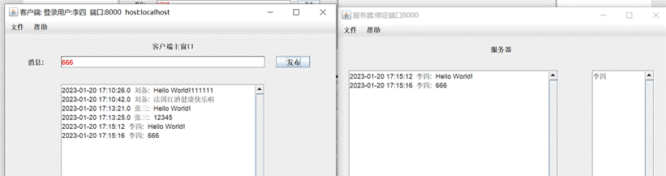

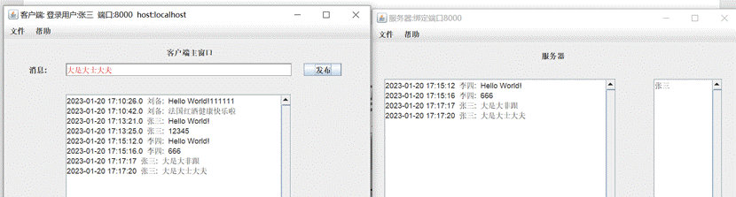

**登录多名用户：**

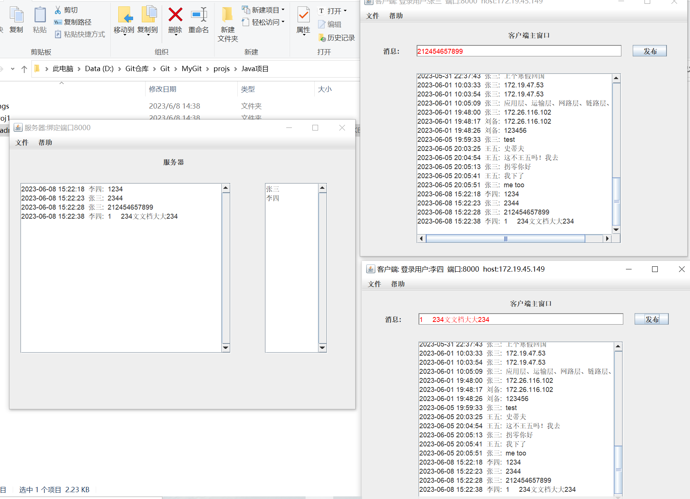**
