# 交互设计文档

## ⼀、 功能介绍

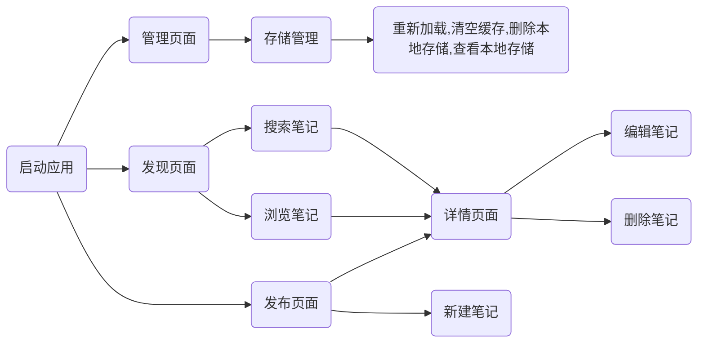

如图所示，本软件具有如下功能：

搜索笔记，浏览笔记；

新建笔记，编辑笔记，删除笔记；

存储管理。

老师好，本次期末大作业我基于作业2实了一个简单的笔记APP，实现了基本的增删改查和存储管理功能，下面我一 一演示这些功能：

搜索笔记，浏览笔记； 新建笔记，编辑笔记，删除笔记； 存储管理。 

 

 

## 二、 功能详细说明

### 2.1 搜索笔记

在顶部搜索框输入想要搜索的信息，然后输入回车即开始搜索，搜索结果如下：

未找到搜索内容时：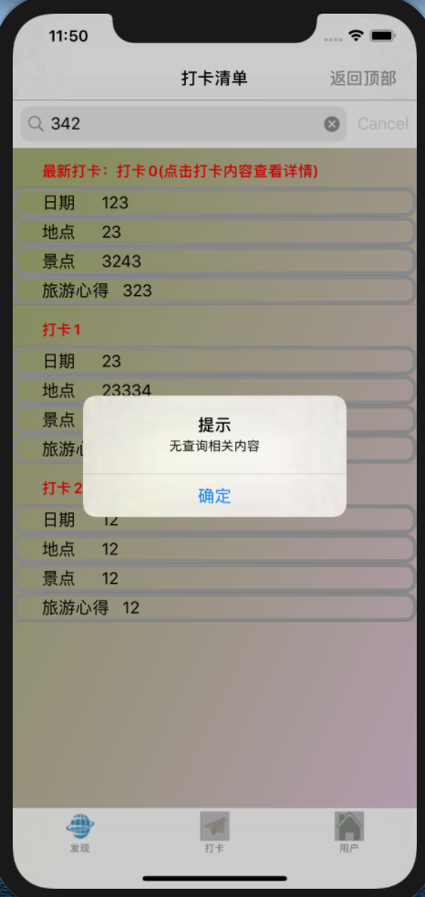 

找到搜索内容时（只返回找到的第一条记录）：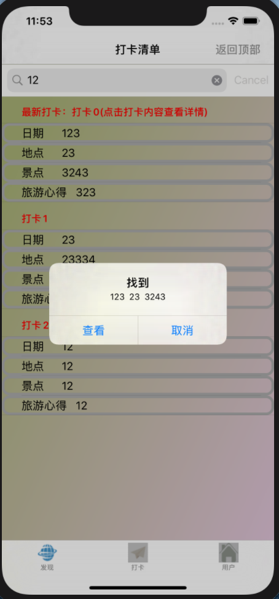 

找到后点击查看即可查看详情：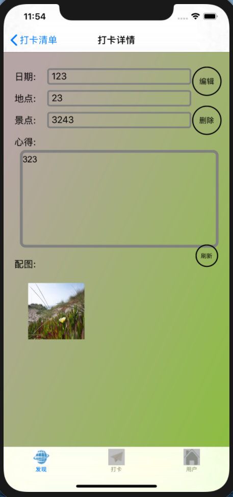 

### 2.2 浏览笔记

如图，可上下滚动查看所有记录：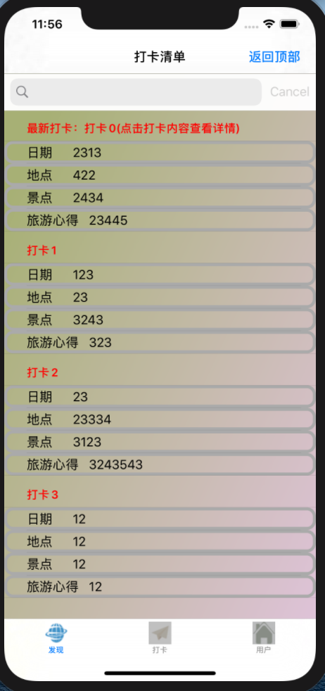 

点击某条记录即可查看详情：       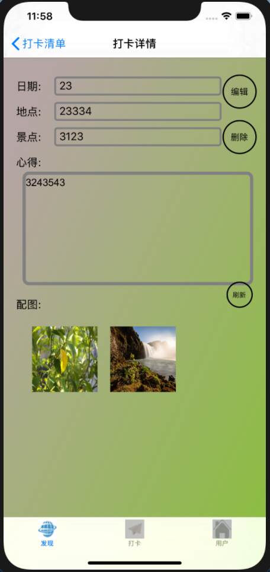 

如果图文没有加载出来，可点击右侧从上往下最后一个圆形按钮——刷新按钮，进行刷新。

### 2.3 新建笔记

在发布页面（打卡页面）输入完记录后，点击右上角发布按钮，再选择"是"即可新建笔记，并进入到相应的详情页面：

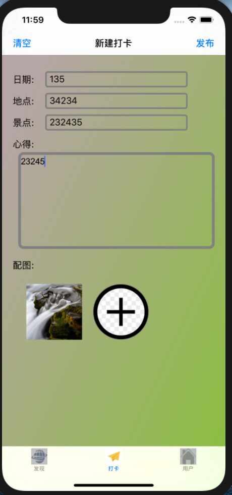          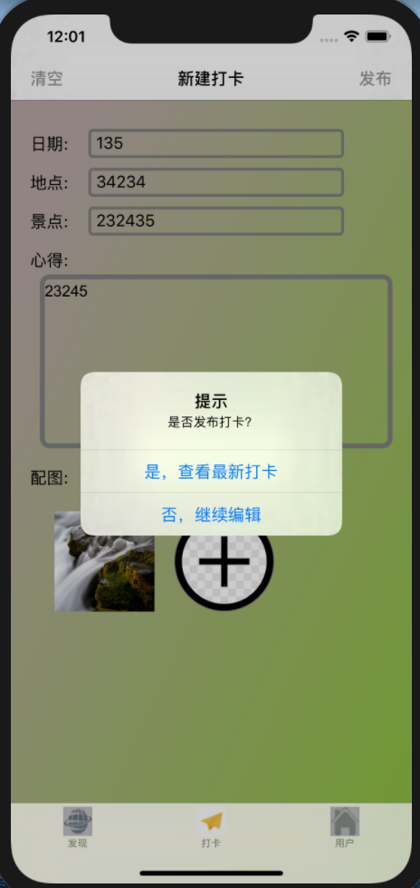   

### 2.4 编辑笔记

进入详情页面后，点击右侧从上往下第一个圆形按钮——编辑按钮，即可进行编辑：

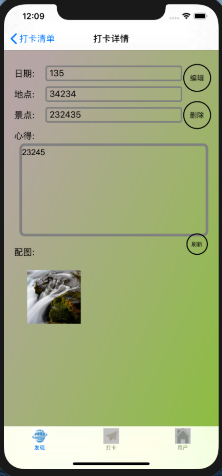        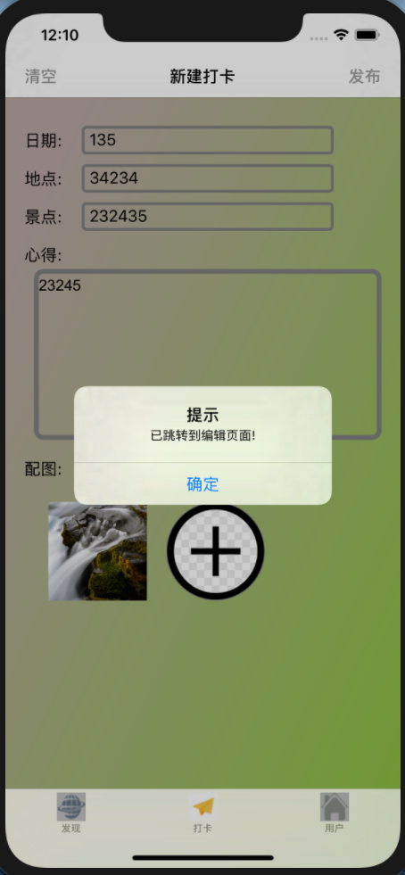 

### 2.5 删除笔记

进入详情页面后，点击右侧从上往下第2个圆形按钮——删除按钮，即可删除该条记录：

             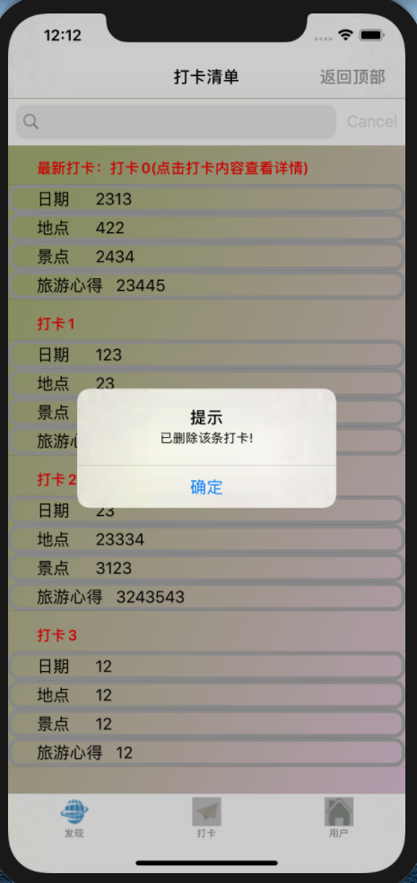 

### 2.6 存储管理

进入用户页面后，可以看到4个圆形功能按钮，每个按钮具备相应功能（重新加载,清空缓存,删除本地存储,查看本地存储）：

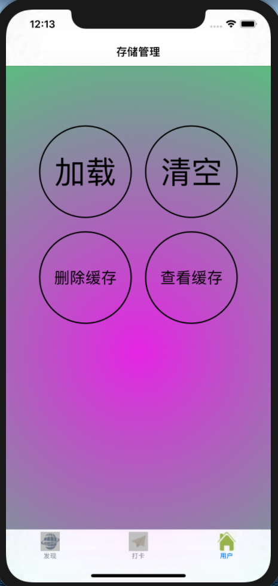 