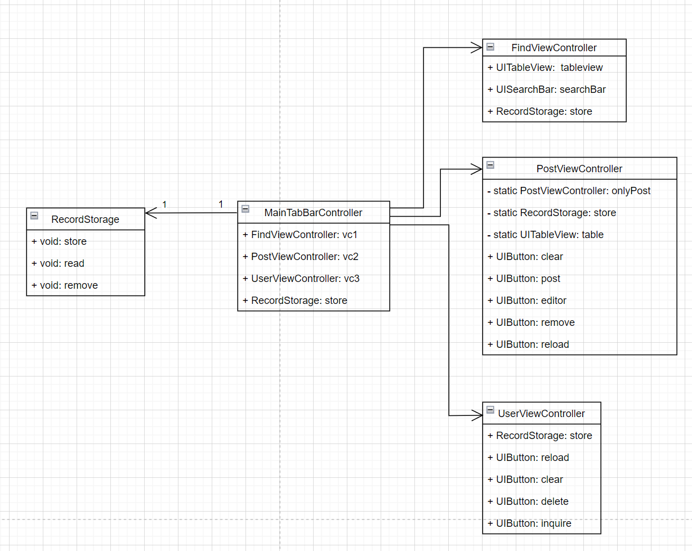

# 架构设计文档

## 一 架构设计思想

​	　本次软件开发使用MVC架构。MVC架构，即Model View Controller（模型-视图-控制器）模式，用一种业务逻辑、数据、界面显示分离的方法组织代码，将业务逻辑聚集到一个部件里面，在改进和个性化定制界面及用户交互的同时，不需要重新编写业务逻辑。MVC被独特的发展起来用于映射传统的输入、处理和输出功能在一个逻辑的图形化用户界面的结构中。它把软件系统分为三个基本部分：

​		模型（Model）：负责存储系统的中心数据。

​		视图（View）：将信息显示给用户（可以定义多个视图）。

​		控制器（Controller）：处理用户输入的信息。负责从视图读取数据，控制用户输入，并向模型发送数据，是应用程序中处理用户交互的部分。负责管理与用户交互交互控制。

　　视图和控制器共同构成了用户接口。

## 二 架构体系描述

​		由于基于UIKit框架进行开发，所以视图与模型的”相互影响“完全依赖于控制器，所以控制器是本次软件开发的重点。在本次开发中，控制器分为视图控制器和模型控制器，通过两种控制器之间的交流，实现视图与模型的”相互影响“。

## 三 系统模块划分

在本次开发中，控制器分为视图控制器和模型控制器：

**视图控制器：**

MainTabBarController

PostViewController， UserViewController，FindViewController

**模型控制器：**

RecordStorage

## 四 模块功能详述

#### MainTabBarController

该模块为主视图控制器，包含3个子视图控制器FindViewController、PostViewController、UserViewController，以及一个模型控制器RecordStorage。

#### FindViewController

该模块用于展示和搜索所有笔记记录。

#### PostViewController

该模块用于编辑、查看、发布、删除笔记。

当该模块用于编辑和发布笔记时，使用单例模式，即只存在一个具备这两种功能的该类型的实例。

当该模块用查看或删除笔记时，使用工厂模式，根据笔记内容生成一个相应的实例。

#### UserViewController

该模块用于用户管理存储空间，可清除缓存、重新加载、删除保存在本地的笔记记录、查看保存在本地的笔记记录。

#### RecordStorage

该模块用于存储、读取、删除保存在本地cache缓存中的笔记记录。

## 五 系统模块关系图

